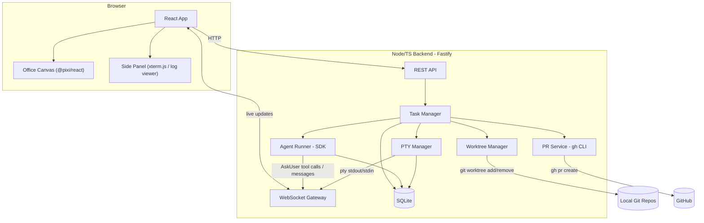
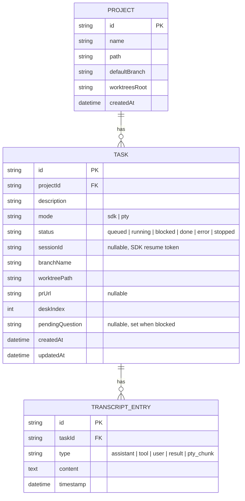

# Agent Office — Detailed Design

## Overview

Agent Office is a local web app for managing multiple Claude Code agent sessions working on different (or the same) git repos in parallel. Each agent is visualized as a pixel-art character in a 2D office (PixiJS canvas) — sitting at a desk while "working," showing a badge when it needs human input, and slacking off when its task is done. Clicking a desk opens a right-side terminal/log panel showing the agent's live output, where the user can answer questions or just watch.

Core loop: user adds a project (git URL or local path) → creates a task (free-text description) → app spins up an isolated git worktree + branch, launches a Claude Agent SDK headless session (or attaches a PTY `claude` session) with full tool permissions → agent works autonomously, surfacing questions via a custom `AskUser` tool → on completion, agent pushes its branch and opens a PR via `gh` → user reviews/merges PR and (manually) removes the worktree.

v1 scope: single local machine, SQLite persistence, session-resume on restart, max 10 concurrent agents (default 4), one shared office floor (desk-per-session), CC0 Kenney art assets, manual PR review/merge/cleanup.

## Detailed Requirements

Consolidated from `idea-honing.md`:

1. **Environment (Q1):** Runs locally now; architecture should not preclude adding a remote-server mode later (agent runners behind an API boundary, not hardwired to local FS).
2. **Agent control (Q2):** Support both Claude Agent SDK headless sessions (for new tasks) and node-pty-wrapped `claude` CLI sessions (for attaching to/viewing interactive sessions).
3. **Visualization fidelity (Q3):** Game-like 2D canvas using PixiJS, animated pixel-art characters.
4. **Spatial layout (Q4):** v1 = one shared office floor, one desk per active session, color/label indicates project. Data model must allow future grouping into per-project rooms/offices without rework.
5. **States & notifications (Q5):** Agent states = `idle`, `working`, `blocked` (needs human input — shown via badge on sprite), `error`, `done`. Clicking a desk/sprite opens a terminal/log panel on the right side of the screen.
6. **Tech stack (Q6):** Node/TypeScript backend (Fastify), `@anthropic-ai/claude-agent-sdk` for headless agents, `node-pty` for PTY sessions, WebSocket for live updates, React + `@pixi/react` (PixiJS v8) frontend. All open-source/free; only ongoing cost is Claude API tokens.
7. **Task creation & isolation (Q7):** Each task gets its own git worktree + branch (`agent/<task-id>`), checked out from the project's default branch. Agent opens a PR when done. Conflict resolution/merging is manual (user reviews PRs) — full auto-merge is a stretch goal, not v1.
8. **Permissions (Q8):** Headless agents run with `permissionMode: "bypassPermissions"` (+ `allowDangerouslySkipPermissions: true`), safe because each runs in its own isolated worktree. Agent only interrupts the user via the `AskUser` tool (Q13) for genuine questions.
9. **Persistence & resume (Q9):** SQLite stores projects, tasks, sessions, transcripts. On server restart, in-progress tasks attempt `resume: session_id` via the SDK; on failure, mark `failed`/needs-attention.
10. **Project registration & completion (Q10):** Add project via UI — git URL (clone) or local path. On task completion (PR opened), the agent's sprite plays an idle "slacking off" animation; the task also moves to a "Completed" list for review.
11. **PR mechanism (Q11):** Use `gh` CLI (assumes user's existing `gh auth` on the host machine) to push the branch and `gh pr create` targeting the project's default branch.
12. **Art assets (Q12):** CC0 Kenney packs (Tiny Town for office/desks, Mini Characters / Isometric Prototypes for character sprites) for v1; custom art later.
13. **Question detection / concurrency / cleanup (Q13):**
    - Custom `AskUser(question: string)` tool registered with the SDK session; when the agent calls it, the task flips to `blocked`, shows a badge, and sends a notification.
    - Max concurrent agents: default 4, configurable, hard cap 10. Tasks beyond the limit are queued.
    - Worktree removal is a manual UI action in v1 (no auto-cleanup on PR merge).

## Architecture Overview



## Components and Interfaces

### 1. Project Registry
- `POST /projects` — body `{ source: "url" | "path", value: string }`. If `url`, clones into a managed directory; if `path`, validates it's a git repo.
- `GET /projects` — list registered projects with `{ id, name, defaultBranch, path }`.
- Stores `worktreesRoot` (derived: `<path>/../<name>-worktrees/`).

### 2. Task Manager
- `POST /projects/:id/tasks` — body `{ description: string, mode: "sdk" | "pty" }`. Creates a `Task` row (`status: "queued"`), enqueues for execution.
- Enforces concurrency limit (config `maxConcurrentAgents`, default 4, max 10): if running count ≥ limit, task stays `queued` until a slot frees.
- `GET /tasks`, `GET /tasks/:id`, `GET /tasks/:id/transcript`
- `POST /tasks/:id/respond` — body `{ message: string }` — delivers the user's answer back into a `blocked` task (SDK: sends as next user message via async iterable prompt; PTY: writes to stdin).
- `POST /tasks/:id/stop` — kills the agent process/PTY, marks `status: "stopped"`.
- `DELETE /tasks/:id/worktree` — manual worktree cleanup (Q13.3).

### 3. Worktree Manager
- `createWorktree(project, taskId)`:
  ```
  git -C <project.path> worktree add <worktreesRoot>/<taskId> -b agent/<taskId> <defaultBranch>
  ```
- `removeWorktree(project, taskId)`:
  ```
  git -C <project.path> worktree remove <worktreesRoot>/<taskId>
  ```
- Returns absolute worktree path used as `cwd` for the agent.

### 4. Agent Runner (SDK mode)
- On task start: register custom `AskUser` tool, call:
  ```typescript
  query({
    prompt: task.description,
    options: {
      cwd: worktreePath,
      permissionMode: "bypassPermissions",
      allowDangerouslySkipPermissions: true,
      tools: [askUserTool],
    }
  })
  ```
- Streams `SDKMessage`s → persists to `transcript` table → maps to office state:
  - `tool_progress` / `assistant` (no AskUser) → `working`
  - `AskUser` tool invocation → `blocked` (store the question, broadcast over WS, send notification)
  - `result` with `subtype: "success"` → run PR Service, then → `done`
  - `result` with error subtype → `error`
- Persists `session_id` after first message for resume.
- On `/tasks/:id/respond` while `blocked`: resumes the async-iterable prompt stream with the user's message, flips state back to `working`.

### 5. PTY Manager (PTY mode)
- Spawns `claude` via `node-pty` with `cwd: worktreePath`.
- Multiplexes PTY stdout to all WS clients subscribed to `task:<id>`; writes browser input to PTY stdin.
- Detach (WS close) does not kill the process; only `/tasks/:id/stop` does.

### 6. Office State Service
- Maintains `Record<taskId, { state: AgentState, deskIndex: number, projectId: string }>` in memory, mirrored from `tasks` table.
- Broadcasts state diffs over a `office` WS channel; frontend canvas subscribes and updates sprites.
- Desk assignment (v1): first-available slot on the shared floor grid, freed when task is removed from the office (stopped + worktree removed, or explicitly dismissed from "Completed").

### 7. PR Service
- On task success: `git -C <worktree> push -u origin agent/<taskId>` then `gh pr create --repo <project> --base <defaultBranch> --head agent/<taskId> --title <derived> --body <summary from transcript>`.
- Stores resulting PR URL on the `Task` row.

### 8. Frontend
- **Office Canvas** (`@pixi/react`): static background image (Tiny Town tiles) with desk positions from a JSON layout config; one `AnimatedSprite` per task at its desk, texture set chosen by `state`; badge overlay sprite shown when `state === "blocked"` or `"error"`.
- **Side Panel**: tabbed — for `mode: "pty"` tasks, renders `xterm.js` bound to the task's WS stream; for `mode: "sdk"` tasks, renders a formatted transcript log (assistant text, tool calls/results, AskUser prompts) with a text input that posts to `/tasks/:id/respond`.
- **Project/Task UI**: form to add project (URL/path), form to create task (project picker + description + mode), "Completed" list with PR links.

## Data Models



`AgentState` (derived for office UI, not stored separately): `idle | working | blocked | error | done`. Derived from `Task.status`:
- `queued` → `idle`
- `running` → `working`
- `blocked` → `working` + badge
- `error` → `error` + badge
- `done` / `stopped` → `done` (idle/slacking-off animation)

## Error Handling

- **Worktree creation fails** (e.g. dirty default branch, branch name collision): task → `error`, error message stored on transcript, surfaced in UI with retry/delete options.
- **`gh` not authenticated / PR creation fails**: task still marked `done` (work completed), but PR field shows error with retry button (manual `gh pr create` retry via API).
- **SDK session resume fails on restart**: task → `failed` (needs-attention); UI shows "resume failed, worktree at `<path>` — review manually" with option to start a fresh task in the same worktree.
- **PTY process crash**: detect exit event, task → `error`, last N lines of output preserved in transcript.
- **Concurrency limit reached**: new tasks created beyond `maxConcurrentAgents` sit in `queued`; Task Manager starts the next queued task whenever a running task transitions to `done`/`error`/`stopped`.
- **WS disconnect**: purely a view concern — does not affect agent process lifecycle (PTY/SDK keep running server-side).

## Testing Strategy

- **Unit tests**:
  - Worktree Manager: mock `git` calls (child_process), verify correct command construction and path handling, including error paths (collision, dirty tree).
  - Task state machine: pure function mapping `(currentStatus, event)` → `nextStatus`, tested exhaustively for all transitions including `AskUser` → `blocked` → respond → `running`.
  - PR Service: mock `gh` invocations, verify argument construction and PR URL parsing.
- **Integration tests**:
  - Agent Runner against a mocked `query()` (inject a fake async generator emitting representative `SDKMessage` sequences, including an `AskUser` tool call) — verify transcript persistence, state transitions, and WS broadcasts.
  - PTY Manager against a fake shell command (not real `claude`) to verify multiplex/attach/detach/stop semantics.
  - SQLite persistence + resume-on-restart: start a task, simulate restart (re-instantiate Task Manager against same DB), verify `resume` is called with stored `session_id`.
- **Frontend tests**:
  - Office Canvas: render with a fixed `tasks` fixture covering all `AgentState` values, snapshot/visual-regression on sprite + badge selection logic (not full PixiJS render, test the state→texture mapping function directly).
  - Side Panel: test SDK transcript renderer with a fixture message log; test `respond` form submission.
- **End-to-end** (manual/Playwright, later): add project → create task → observe desk appear/animate → simulate `AskUser` → respond via panel → task completes → PR link appears in Completed list.

## Appendices

### A. Technology Choices

| Choice | Why | Trade-off |
|---|---|---|
| Fastify | Lightweight, fast, good WS plugin ecosystem | Smaller plugin ecosystem than Express |
| SQLite (better-sqlite3) | Zero-config local persistence, synchronous API simplifies state-machine code | Not suitable if/when multi-machine remote mode is added (would need Postgres) |
| `@pixi/react` | Official React bindings for PixiJS v8, declarative sprite management | Slight abstraction overhead vs raw PixiJS |
| Static background + JSON desk config (vs Tiled tilemap) | Simplest for v1 fixed shared-floor layout (Q4 = A) | Less flexible if layout needs to be user-editable; revisit if/when rooms-per-project (Q4 = B/C) is built |
| Custom `AskUser` tool (vs text-heuristic detection) | Unambiguous server-side signal for "blocked" state | Requires agent's task prompt/system prompt to instruct use of the tool — agent must cooperate |

### B. Existing Solutions Analyzed
- **cubicle.run** — the inspiration; cute office-themed visualization of running agents. We're building our own for flexibility (self-hosted, full control over agent backend, worktree/PR automation).

### C. Alternative Approaches Considered
- **Full auto-merge / conflict-resolution bot** for concurrent worktrees on the same project — rejected for v1 as too complex; manual PR review is the safety net. Revisit once worktree-per-task is stable.
- **Per-project office rooms (Q4 option B/C)** — deferred; v1 ships shared floor with project color-coding, but `Task.projectId` + a future `Project.roomLayout` field keeps this open.
- **Text-heuristic question detection** — rejected in favor of custom `AskUser` tool (see table above) for reliability.

### D. Constraints & Open Items for Implementation
- Concurrency cap configurable 1–10, default 4 (Q13.2).
- Worktree cleanup is manual (Q13.3) — UI must surface worktree path/disk usage so stale worktrees are discoverable.
- Dependency installation per worktree (e.g. `npm install`) may add latency per task; not addressed in v1, flagged as future optimization (e.g. shared package cache / pnpm store).
- Remote-server mode (Q1) not built in v1, but Task Manager / Agent Runner / PTY Manager should be designed behind clear interfaces so they could later run on a remote host with the API/WS layer as the boundary.
