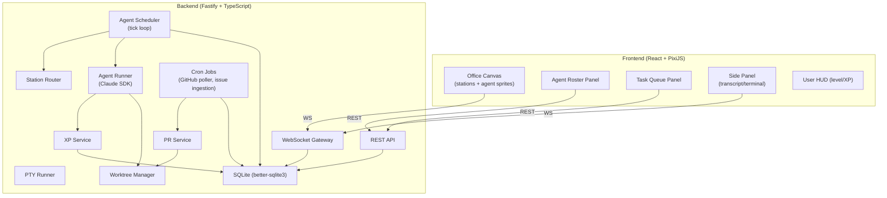

# Detailed Design — Agent Sims

## Overview

A Sims-like browser app for managing AI coding agents. Persistent agents with procedurally generated personalities live in a pixel-art office, autonomously pulling tasks from a priority queue and executing a multi-stage pipeline (Prioritize → Plan → Implement → Review → Merge). Agents walk between office stations to perform work. A leveling/XP system ties agent and user progression to real coding output.

---

## Detailed Requirements

### Agent System
- Agents are persistent entities with name, job type, personality, level, XP, avatar (sprite)
- Procedurally generated on "hire": random name + personality trait bundle + avatar assigned
- Job types: **Prioritizer**, **Planner**, **Implementer**, **Reviewer**, **Merger**
- Each job type maps to a best-fit Claude model (configurable, defaults below)
- Multiple agents of same job type allowed — they compete for the same stage queue
- Agents grouped into **squads**; squads scoped to specific projects
- Agents can be fired (removed from roster, tasks reassigned)

### Personality System
- Generated at hire time: 3-5 traits randomly drawn from a trait pool
- Traits inject into system prompt (e.g. "cautious" → "Always add comprehensive tests")
- Traits apply behavioral modifiers (e.g. "thorough" → higher test coverage target, "swift" → shorter planning phase)
- Traits affect rest duration between tasks (e.g. "workaholic" → shorter rest, "relaxed" → longer)

### Pipeline Stages
```
Task created → [queued:prioritize] → Prioritizer → [queued:plan] → Planner
→ [queued:implement] → Implementer → [queued:review] → Reviewer
→ [queued:merge] → Merger → done
```
- Each stage executes in its own Claude agent call in the task's git worktree
- Stage uses the model assigned to that job type
- On stage completion, task auto-advances to next stage queue
- `requires_human_review` flag on task: pauses at each stage transition for human approval
- Review → Implement loop: max 3 cycles; on 4th rejection task marked `stuck`

### Task Sources
- Human-created via UI: title, description, project, priority (1-5), `requires_human_review` flag
- GitHub issue ingestion: server cron polls registered repos, creates tasks from open issues
- Prioritizer agent periodically re-scores queue based on age, dependencies, labels

### Office Stations
| Station | Agent types | Mechanic |
|---|---|---|
| Planning Board | Prioritizer, Planner | Agent walks here before Prioritize/Plan tasks execute |
| Work Desk | Implementer, Reviewer, Merger | Agent walks here before code tasks execute |
| Meeting Room | Any | Agent goes here when blocked on human input |
| Relaxation Area | Any | Agent here when idle; rest timer counts down before next task pickup |
| PR Wall | Visual | Background display of open PRs + CI status; clickable |

Agent must complete walk animation to station before task execution begins.

### Git Workflow
- Each task gets a dedicated git worktree + branch (`agent/<taskId>`) on creation
- Merger auto-merges to default branch when: CI passes + Reviewer approved (no human click needed)
- Configurable per repo: can disable auto-merge (PR-only mode)
- Server cron polls open PRs for new human review comments every N minutes
- Unresolved human comments → new Implementer task created targeting same worktree

### XP & Leveling
**Agents:**
- Earn XP per completed stage (amount scales with task complexity estimate)
- Agent level unlocks: stat boosts (rest duration reduction, model quality bump), cosmetic unlocks (animation variants)

**User / Office:**
- User earns XP per completed pipeline (merged PR)
- User level unlocks: more desk slots, new rooms, higher hire cap
- Default scale: level 1 = 2 desks, level 3 = 4 desks, level 5 = 6 desks + Meeting Room, level 8 = 10 desks, etc.

### Hiring
- "Hire Agent" button in UI
- Select job type → system generates name + traits + avatar
- Office capacity (max active agents) gated by user level
- "Fire Agent" removes from roster; any in-progress task gets `stuck`

---

## Architecture Overview



---

## Components and Interfaces

### Backend

#### `agents` service
- `POST /agents` — hire (job_type → generate personality + avatar)
- `DELETE /agents/:id` — fire
- `GET /agents` — list with level/XP/current_station/current_task

#### `squads` service
- `POST /squads` — create squad, assign agents + projects
- `GET /squads`

#### `tasks` service
- `POST /tasks` — create task (project, title, description, priority, requires_human_review)
- `GET /tasks` — list with stage + assigned agent
- `POST /tasks/:id/approve` — advance past human-review gate
- `POST /tasks/:id/respond` — respond to blocked agent question

#### `AgentScheduler`
- Tick every N seconds
- For each idle agent: find highest-priority task in their stage queue, filtered by squad project scope
- Dispatch: call StationRouter to walk agent to station, then fire AgentRunner on arrival

#### `StationRouter`
- Tracks each agent's current station
- `walkTo(agentId, station)` → emits WS position updates over walk duration
- `onArrival(agentId)` → callback to start task execution

#### `AgentRunner`
- Wraps Claude SDK `query()`
- Builds system prompt: base role prompt + personality trait injections + stage-specific instructions
- Selects model per job type
- Streams transcript entries to WS + DB
- On completion: calls XPService, advances task stage

#### `XPService`
- `awardAgentXP(agentId, amount)` → update agent XP/level, emit WS event
- `awardUserXP(amount)` → update user profile XP/level, emit WS event, check office unlocks

#### `CronService`
- GitHub issue ingestion: poll registered repos (configurable interval, default 15min)
- PR comment poller: check open agent PRs for new human comments (default 5min)

### Frontend

#### `OfficeCanvas` (PixiJS)
- Static background: LimeZu Room Builder tiles (planning board room, desk area, lounge, meeting room)
- One sprite per hired agent, positioned at current station
- Walk animation: lerp sprite position over walk duration
- Click agent → open SidePanel for that agent
- PR Wall: scrolling ticker of open PRs + CI badges

#### `AgentRosterPanel`
- List of all agents with avatar, name, job type, level, XP bar
- "Hire Agent" flow, "Fire" button per agent
- Squad assignment UI

#### `TaskQueuePanel`
- Create task form (project, description, priority slider, human-review toggle)
- Pipeline view: columns per stage with tasks as cards
- Task cards show: assigned agent, priority badge, loop count

#### `SidePanel`
- SDK task: scrollable transcript log
- PTY task: xterm.js terminal
- Blocked task: question display + reply input

---

## Data Models

```sql
-- User profile (single row)
CREATE TABLE user_profile (
  id INTEGER PRIMARY KEY DEFAULT 1,
  level INTEGER NOT NULL DEFAULT 1,
  xp INTEGER NOT NULL DEFAULT 0,
  xp_to_next INTEGER NOT NULL DEFAULT 100
);

-- Agents
CREATE TABLE agents (
  id TEXT PRIMARY KEY,
  name TEXT NOT NULL,
  job_type TEXT NOT NULL CHECK(job_type IN ('prioritizer','planner','implementer','reviewer','merger')),
  model TEXT NOT NULL,
  level INTEGER NOT NULL DEFAULT 1,
  xp INTEGER NOT NULL DEFAULT 0,
  avatar TEXT NOT NULL,         -- sprite sheet name (Adam/Alex/Amelia/Bob)
  personality JSON NOT NULL,    -- { traits: string[], modifiers: {...}, rest_seconds: number }
  current_station TEXT,         -- null when walking
  current_task_id TEXT,
  squad_id TEXT,
  hired_at TEXT NOT NULL,
  fired_at TEXT
);

-- Squads
CREATE TABLE squads (
  id TEXT PRIMARY KEY,
  name TEXT NOT NULL,
  project_ids JSON NOT NULL DEFAULT '[]'
);

CREATE TABLE squad_agents (
  squad_id TEXT NOT NULL,
  agent_id TEXT NOT NULL,
  PRIMARY KEY (squad_id, agent_id)
);

-- Projects
CREATE TABLE projects (
  id TEXT PRIMARY KEY,
  name TEXT NOT NULL,
  path TEXT NOT NULL,
  default_branch TEXT NOT NULL DEFAULT 'main',
  worktrees_root TEXT NOT NULL,
  auto_merge INTEGER NOT NULL DEFAULT 1,
  github_url TEXT,
  created_at TEXT NOT NULL
);

-- Tasks
CREATE TABLE tasks (
  id TEXT PRIMARY KEY,
  project_id TEXT NOT NULL,
  title TEXT NOT NULL,
  description TEXT NOT NULL,
  priority INTEGER NOT NULL DEFAULT 3 CHECK(priority BETWEEN 1 AND 5),
  stage TEXT NOT NULL DEFAULT 'queued:prioritize',
  status TEXT NOT NULL DEFAULT 'queued',  -- queued | running | blocked | stuck | done | error
  requires_human_review INTEGER NOT NULL DEFAULT 0,
  review_loop_count INTEGER NOT NULL DEFAULT 0,
  worktree_path TEXT,
  branch TEXT,
  pr_url TEXT,
  source TEXT NOT NULL DEFAULT 'human',  -- human | github_issue
  github_issue_number INTEGER,
  created_at TEXT NOT NULL,
  updated_at TEXT NOT NULL
);

-- Task stage executions
CREATE TABLE task_stages (
  id TEXT PRIMARY KEY,
  task_id TEXT NOT NULL,
  stage TEXT NOT NULL,
  agent_id TEXT NOT NULL,
  model TEXT NOT NULL,
  status TEXT NOT NULL DEFAULT 'running',  -- running | done | failed
  session_id TEXT,
  xp_awarded INTEGER NOT NULL DEFAULT 0,
  started_at TEXT NOT NULL,
  completed_at TEXT
);

-- Transcript entries
CREATE TABLE transcript_entries (
  id INTEGER PRIMARY KEY AUTOINCREMENT,
  task_stage_id TEXT NOT NULL,
  role TEXT NOT NULL,
  content TEXT NOT NULL,
  created_at TEXT NOT NULL
);

-- Worktrees
CREATE TABLE worktrees (
  id TEXT PRIMARY KEY,
  task_id TEXT NOT NULL,
  path TEXT NOT NULL,
  branch TEXT NOT NULL,
  status TEXT NOT NULL DEFAULT 'active',
  created_at TEXT NOT NULL
);
```

---

## Error Handling

- **Review loop max (3):** Task → `stuck`, badge on agent sprite, surfaced in TaskPanel with manual retry option
- **Merger CI failure:** Task stays at `queued:merge`, retry after configurable delay (default 10min)
- **Agent runner crash:** Task → `error`, agent returns to lounge, XP not awarded
- **GitHub cron failure:** Log error, skip cycle, retry next interval (no crash)
- **Worktree collision:** Unique branch name per taskId prevents collision
- **Fire agent with active task:** Task → `stuck`, worktree preserved for manual recovery

---

## Testing Strategy

- Unit tests per service module (scheduler, XP, station router, personality generator)
- Integration tests per API route group (agents, tasks, squads, projects)
- Agent runner tests using mocked Claude SDK generator
- Frontend: unit tests for stage→station mapping, walk animation state machine
- No E2E browser tests in v1

---

## Appendices

### Technology Choices
- **Claude SDK models per stage:**
  - Prioritizer: `claude-haiku-4-5-20251001` (fast, cheap queue scoring)
  - Planner: `claude-opus-4-8` (deep reasoning for spec writing)
  - Implementer: `claude-sonnet-4-6` (code quality + speed balance)
  - Reviewer: `claude-sonnet-4-6` (thorough diff analysis)
  - Merger: `claude-haiku-4-5-20251001` (mechanical steps — run tests, push, PR)

- **PixiJS** for office canvas (already in codebase, performant for sprite animation)
- **better-sqlite3** for SQLite (sync, simple, already in codebase)
- **node-cron** for GitHub polling and issue ingestion
- **LimeZu Modern Interiors** tiles for office layout (already in `/assets`)
- **Adam/Alex/Amelia/Bob** sprite sheets for agent avatars (already in `/assets`)

### Reuse from Prior Codebase
- Keep: `worktrees.ts`, `pr-service.ts`, `pty-runner.ts`, `ws-events.ts`, PixiJS canvas skeleton, xterm.js terminal component, all asset files
- Rewrite: `db.ts` (new schema), `task-manager.ts` (new scheduler), `agent-runner.ts` (stage-aware), frontend layout, `App.tsx`
- Remove: `desks.ts` (replaced by station router), `KanbanBoard.tsx` (replaced by TaskQueuePanel with pipeline view)
